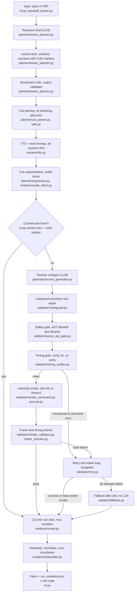

# manimgen architecture

Paths are relative to the git root. The Python package is `manimgen/manimgen/`.

## 1. Overview and pipeline

manimgen turns a topic string or a PDF of lecture notes into a narrated,
3Blue1Brown-style explainer video. An LLM researches the topic and writes a
storyboard whose narration carries `[CUE]` markers. Text to speech (edge-tts)
produces the audio and the time of every spoken word, so each cue gets an exact
duration from the real audio. A second LLM role, the Director, writes one ManimGL
scene per section and is told how long each cue lasts. Everything the LLM writes
passes deterministic layers before it is trusted: a static repair pass, a safety
gate, a timing check, and after rendering, frame checks. Failures go to a bounded
repair loop and then to a plain title card, so one bad section does not end the
run. ffmpeg cuts each rendered section at the cue boundaries, lays the narration
on each piece and joins them. The run ends with a video and a `run_manifest.json`
that records what happened to every section.

Two orderings matter. Narration runs for all sections before any scene is
generated (`cli.main`, phase 1): cue durations are inputs to the Director, and a
speech outage should cost only the planning calls. And the safety gate sits on
the render function itself (`render_command.run_manimgl`), so no path can render
an unchecked file. (`manimgen/manimgen/renderer/cutter.py` only re-exports the cutting functions
that live in `manimgen/manimgen/renderer/muxer.py`.)

## 2. Module map

| Path | Responsibility |
|---|---|
| `manimgen/manimgen/cli.py` | Entry point: planning, audio phase, per-section orchestration, cache keys, section statuses, exit codes, manifest |
| `manimgen/manimgen/llm.py` | One `chat()` for all providers; `claude -p` runner; paid-API, auth and overage guards; per-role models; usage ledger |
| `manimgen/manimgen/config.py`, `manimgen/manimgen/paths.py` | Single validated loader of `manimgen/config.yaml` (`ConfigError`, no silent defaults); output paths; render quality, fps, timeouts |
| `manimgen/manimgen/types.py` | `SectionStatus`, `SectionOutcome`, `RenderResult`, `GateResult`, `CueSegment` |
| `manimgen/manimgen/procutil.py` | `run_tree`: a child process whose timeout kills the whole tree |
| `manimgen/manimgen/utils.py` | Section id sanitizing, atomic output, `is_usage_stop`, ffprobe helpers |
| `manimgen/manimgen/techniques.py` | The one registry of animation techniques (planner menu, critic, 3D promotion, example tags) |
| `manimgen/manimgen/input/pdf_parser.py` | PDF to cleaned text chunks and page images (50 page cap) |
| `manimgen/manimgen/planner/lesson_planner.py` | Research, storyboard, critic pass and its acceptance rules, section caps, JSON repair, cue refill |
| `manimgen/manimgen/planner/cue_parser.py`, `manimgen/manimgen/planner/segmenter.py` | `[CUE]` markers to word indices; word timestamps to per-cue durations |
| `manimgen/manimgen/generator/scene_generator.py` | The Director: prompt (storyboard, durations, matching verified examples), scene file, precheck, gate |
| `manimgen/manimgen/validator/codeguard.py` | Deterministic repair of known ManimGL mistakes, banned patterns, layout and timing smells, traceback-driven fixes |
| `manimgen/manimgen/validator/manimlib_symbols.py`, `manimgen/manimgen/validator/manimlib_signatures.py` | Report-only checks of symbols and constructor kwargs against the installed `manimlib` |
| `manimgen/manimgen/validator/scene_ast_gate.py` | Whole-tree safety gate for LLM-written scene code |
| `manimgen/manimgen/validator/render_command.py`, `manimgen/manimgen/validator/runner.py`, `manimgen/manimgen/validator/env.py` | The only `manimgl` launcher (enforces the gate); render log and strict "which video is this render's"; allowlisted child environment |
| `manimgen/manimgen/validator/timing_verifier.py` | Static per-cue timing analysis and deterministic auto-fix |
| `manimgen/manimgen/validator/render_validator.py`, `manimgen/manimgen/validator/frame_checker.py`, `manimgen/manimgen/validator/layout_checker.py` | Post-render checks: pixel checks, optional LLM vision check |
| `manimgen/manimgen/validator/retry.py`, `manimgen/manimgen/validator/fallback.py` | Budgeted repair loop; deterministic title card |
| `manimgen/manimgen/validator/invariants.py`, `manimgen/manimgen/validator/evidence_log.py` | Design-rule checks; JSONL evidence of what the repair layers did |
| `manimgen/manimgen/renderer/tts.py`, `manimgen/manimgen/renderer/audio_slicer.py` | edge-tts with word timestamps (3 attempts); cue-aligned AAC slices |
| `manimgen/manimgen/renderer/muxer.py`, `manimgen/manimgen/renderer/assembler.py` | Cut and mux (pad only, never speed-warp); normalize, hard cuts, 0.3 s section crossfades |
| `manimgen/manimgen/editor/server.py` | Local Flask clip editor (`manimgen-edit`) |
| `manimgen/eval/`, `manimgen/scripts/` | Codeguard corpus, damage measurement and baseline; `env_doctor.py`, `render_smoke.py`, `check_billing.py` |
| `manimgen/manimgen/examples/` | Hand-verified scenes shown to the Director; each must pass the safety gate |
| `.github/workflows/` | `ci.yml`, `nightly-render.yml`, `secret-scan.yml` |

## 3. Key design decisions

### 3a. LLM calls through `claude -p` on a subscription

Problem. A video needs many LLM calls (research, plan, critic, one Director call
per section, repairs, vision checks). Per-token billing makes experiments costly.

Decision. The default provider runs each call as one `claude -p` subprocess
(`llm._claude_cli`): system prompt via `--system-prompt-file`, user turn and
base64 frames on stdin as one `stream-json` message, tools off (`--tools=`),
strict empty MCP, no session persistence, an empty temp working directory.
Nothing large is on the command line (Windows caps it near 32K characters). The
child gets an allowlisted environment with `ANTHROPIC_API_KEY`,
`ANTHROPIC_AUTH_TOKEN` and the cloud provider switches removed: a stray key would
make Claude Code bill per token with no visible sign. Three guards keep "no cost"
true:

- Paid-API guard: `anthropic` and `gemini` raise `PaidApiBlockedError` unless
  `MANIMGEN_ALLOW_PAID_API=1`.
- Auth-source check: the stream's `init` event reports `apiKeySource`;
  `_ensure_subscription_auth` raises on anything but the subscription login
  (for example an `apiKeyHelper`). It runs after the call, so it stops the run
  before a second paid call.
- Overage guard: `_check_plan_limits` stops if a call was billed as overage, and
  `_ensure_plan_headroom` refuses to start a call when a plan window is at or
  above `MANIMGEN_MAX_PLAN_UTILIZATION` (default 0.90) and overage is not
  explicitly `rejected`. A missing field counts as "could bill".

`utils.is_usage_stop` recognizes these and plan usage limits; `cli.main` then
stops cleanly with exit code 4 and `--resume` continues after the reset.

Alternatives. API providers (kept, gated); local Ollama (kept, loopback-only URL
check, lower quality).

Trade-off. Per-call latency from starting Claude Code. The guards read
`stream-json` fields that are not a documented contract, so each is parsed
defensively. No native JSON mode: `json_mode=True` only strips a code fence, so
the planner validates and re-asks (`_chat_plan`). Subscription windows can run
out mid-run, which is a resumable stop, not a crash.

Where. `manimgen/manimgen/llm.py`, `manimgen/scripts/check_billing.py` (one small
call that reports whether billing is impossible), `manimgen/tests/test_llm.py`.

### 3b. Deterministic validators enforce; the LLM proposes

Problem. Early versions asked the LLM to fix things a program can compute. The
clearest case is timing: each cue's animations must add up to the narration
length, LLMs are poor at that arithmetic (loops were the usual miss), and a
reprompt can break a correct scene.

Decision. The principle, from `docs/roadmap/2-week-plan.md`: the LLM proposes
structure and taste, the deterministic layer computes and enforces every value it
can, and the LLM is reprompted only when the fix needs perception or judgment.

- Cue boundaries and durations come from the audio, not the LLM.
- `timing_verifier.auto_fix_timing` sets the last `self.wait()` to the exact
  residual, inserts a wait where a cue has none, scales literal `run_time`
  values (stretch capped at 3x, floor 0.1 s) and deletes cue blocks beyond the
  real cue count. No LLM is involved.
- `codeguard` rewrites known ManimCommunity-to-ManimGL mistakes before any
  render.
- Reprompts are for what code cannot decide: a traceback with no matching rule,
  and visual defects needing a vision model.
- Unknowns are explicit. A duration that depends on a variable is `UNKNOWN`
  (tri-state, not 0 or 1.0) and a cue containing one can never be called a
  freeze (`blocking_freezes`). Coercing unknowns once made correct scenes look
  short and forced destructive retries.
- A frozen frame is a hard failure only when timing independently confirms a dead
  tail (`join_frozen_with_timing`); a still frame during a deliberate hold is fine.

Alternatives. Stronger prompts (kept, not relied on); one retry loop for every
defect; schema-constrained JSON decoding (not done).

Trade-off. Static analysis sees literals and simple loops only, so dynamic
cases are reported as unverifiable, not fixed. Every rule is hand-written and a
wrong rule damages good code, which is why 3h exists.

Where. `manimgen/manimgen/validator/timing_verifier.py`,
`manimgen/manimgen/validator/codeguard.py`,
`manimgen/manimgen/validator/render_validator.py`,
`manimgen/manimgen/planner/segmenter.py`. Not implemented from that roadmap: the
`CUE_FILL` sentinel (the code only writes a `# CUE_FILL auto-inserted` comment)
and provider-enforced JSON schemas (the planner still repairs JSON heuristically
in `lesson_planner._parse_plan_json`).

### 3c. The safety gate for LLM-written code

Problem. `manimgl file.py Class` imports the module and runs `construct()` with
the user's full rights. The code comes from an LLM that reads the user's topic or
PDF, so injected instructions in a document could produce code that reads,
deletes or uploads files. The section id, also LLM-written, becomes a filename.

Threat model. The attacker controls text the LLM reads (a PDF, a topic), not the
machine. The goal is to stop generated code that touches the filesystem, network,
processes or credentials. A human hand-writing a bypass is out of scope.

Decision. `scene_ast_gate` parses the file (never runs it) and walks the whole
tree: module, class and method bodies, nested functions, lambdas,
comprehensions, decorators, default arguments, f-strings. It enforces:

- an import allowlist of pure modules (`manimlib`, `numpy`, `math`, `random`,
  `itertools` and a few more) and no relative or star imports beyond
  `from manimlib import *`;
- a denylist of builtins that execute code or reach outside (`exec`, `eval`,
  `compile`, `open`, `__import__`, `globals`, ...) and of names that
  `from manimlib import *` leaks into scope (`os`, `sys`, `pickle`, `Path`, ...);
- attribute rules: file, pickle and process methods whatever the receiver, most
  dunders, frame and code-object attributes, `getattr` on computed names;
- string rules: URLs and UNC paths (manimlib downloads an http path given to an
  image or SVG mobject; a UNC path makes Windows open an SMB connection) and TeX
  primitives that read, write or run commands;
- structure: module level holds only a docstring, allowed imports, functions,
  plain assignments and one class; no class decorators or metaclass; no
  non-UTF-8 coding declaration (Python executes the bytes and honours a PEP 263
  cookie that the parsed text hides).

Hard block on every render path. `run_manimgl` is the single launcher for first
render, retry and fallback and runs `inspect_scene_file` first; a rejected file
never reaches manimgl and the findings come back as the error. The generator
raises `ScenePrecheckError` so the draft goes to repair; `retry._discard_unsafe_fix`
drops a rejected LLM fix and restores the previous code; fallback text is gated.
Around it: `manimgen/manimgen/validator/env.py` passes only allowlisted variables to the render
child (a scene cannot read API keys), and `utils.sanitize_section_id` coerces ids
to `[a-z0-9_]`, re-applied at every filesystem sink including `--resume`.

It is not a sandbox. It is a static denylist plus an import allowlist; Python is
dynamic enough that an author can build an attribute name or URL at runtime and
reach something no list foresaw. A scene that passes still runs with the user's
rights, so the docs say to use only trusted topics and PDFs. Real containment (a
launcher with a PEP 578 audit hook denying sockets, unexpected process spawns and
writes outside the output folder) is deferred (issue #87, option 2). Codeguard is
deliberately not called a security layer: its patterns are API-compatibility rules.

Alternatives. A container or VM (heavy, and unavailable without admin on the
target PC); a restricted interpreter (Python has none that holds); trusting the
prompt (not a control).

Trade-off. False positives block legitimate scenes, so the rule is to widen the
gate narrowly with a test and never to route a render around `run_manimgl`.

Where. `manimgen/manimgen/validator/scene_ast_gate.py`,
`manimgen/manimgen/validator/render_command.py`, `manimgen/manimgen/validator/env.py`,
`manimgen/tests/test_scene_gate_attacks.py` (attack corpus; every example must
pass), `manimgen/tests/test_scene_gate_wiring.py`.

### 3d. Content-addressed caching of per-section artifacts

Problem. Rendering is slow, so `--resume` must reuse finished work. An early
cache named files by section id, but planners emit generic ids, so a different
topic or an edited plan produced the same file name and shipped a stale clip from
another video. Changing voice, speed or render quality also reused wrong files
(issue #66).

Decision. Each cached video and muxed cue clip has a `.hash` sidecar. The section
key (`cli._section_key`) hashes the whole section dict (title, narration, cue
indices, visuals), the run hash and the cue durations rounded to 0.05 s. The run
hash (`cli._content_hash`) covers the topic string or PDF bytes (so a PDF edited
in place differs), TTS voice and speed, and render quality flag, resolution and
fps. A file is reused only if it exists, is non-empty and its sidecar equals the
current key (`_render_is_fresh`). The sidecar also stores a non-`ok` status, so a
cached fallback card is still reported as `fallback` on `--resume`. Audio slices
are always re-sliced. A cached render is re-checked for freeze tails against its
scene source, so the cache cannot bypass the timing gate. Plan, sidecar and encoder
output are written to a temp file and moved with `os.replace`
(`utils.atomic_output`), so a killed process never leaves a half file that looks valid.

Alternatives. Section ids as keys (the bug); one hash per run (any change
rebuilds everything); mtimes (unreliable across copies).

Trade-off. The 0.05 s rounding lets TTS timing jitter hit the cache but hides a
sub-50 ms change. The whole section dict is hashed on purpose: a missed field
yields a wrong video, which is worse than a rebuild.

Where. `manimgen/manimgen/cli.py`, `manimgen/tests/test_render_cache.py`,
`manimgen/tests/test_cross_plan_cache.py`.

### 3e. Audio-driven timing

Problem. Narration and animation must line up, speed-warping either looks or
sounds wrong, and an LLM cannot predict how long a sentence takes to say.

Decision. Audio comes first and drives the rest.

1. The planner writes narration with `[CUE]` markers. `cue_parser.parse_cues`
   strips them and records each marker's word index (starting at 0). `cues[]`
   needs one visual per segment; a mismatch triggers a targeted LLM refill, then a
   visual derived from the segment's own words.
2. `tts.generate_narration` streams edge-tts with `boundary="WordBoundary"` and
   keeps each word's start and end.
3. `segmenter.compute_segments` turns indices into durations. Cue 0 starts at 0.0
   (pre-speech silence kept); a cue ends at the `end` of its last word, not the
   `start` of the next, so no last syllable is clipped. Durations sum to the audio.
4. `str.split()` and edge-tts tokenize contractions, numbers and hyphens
   differently, so `cue_parser.align_cue_indices` re-derives each index against
   the TTS tokens. An in-range but shifted index would silently pick the wrong
   word.
5. `audio_slicer` cuts one AAC slice per cue (re-encoded: no MP3 frame drift).
6. The Director gets the durations and marks blocks `# CUE N`.
   `timing_verifier.verify_timing` splits by those comments, sums `run_time` and
   `wait` literals (loop counts included) and compares with the duration. Under
   1.0 s is tolerated (the muxer pads it); a cue short by 2.5 s or more
   (`MANIMGEN_FREEZE_BLOCK_THRESHOLD`) is a blocking dead screen.
7. `cut_video_at_cues` cuts at the cumulative durations and `mux_audio_video`
   overlays each slice, freezing the last frame by the gap if audio is longer.
   It never changes speed. Mismatches over 1.0 s are logged and recorded.

Alternatives. Estimate from word count (the Director's fallback, 130 words per
minute, only when there is no audio); stretch video (visible); a forced aligner
(extra dependency, TTS already gives timings).

Trade-off. Dynamic durations are invisible to the static check, so some freeze
tails are caught only by the frame checker or not at all. Re-indexing relies on a
character-level match with clamping as the last resort.

Where. `manimgen/manimgen/planner/segmenter.py`, `manimgen/manimgen/renderer/muxer.py`,
`manimgen/manimgen/validator/timing_verifier.py`,
`manimgen/tests/test_pipeline_contracts.py`, `manimgen/tests/test_cue_tokenization.py`.

### 3f. Failure policy: statuses, exit codes, partial videos

Problem. A run makes dozens of LLM, render and ffmpeg calls and some will fail.
Aborting on the first failure wastes finished work; silently shipping a broken
section hides the failure.

Decision. Every section ends in one `SectionStatus` (`types.py`): `ok`,
`accepted_with_defects`, `fallback`, `dropped`, `silent`, `errored`, `not_run`;
the last five are "degraded". `cli.main` catches an exception from one section,
records `errored`, continues, and assembles what exists. Within a section: a
failed first render, hard frame failure or blocking freeze goes to the retry
loop; if retries are exhausted but an earlier attempt rendered, the best one
ships (`accepted_with_defects` if freezes remain); if nothing rendered, a
fallback title card (`fallback`), or `dropped` if that fails too. If any cue
cannot be muxed with narration, the whole section is dropped rather than shipping
a silent clip (`_cut_and_mux`).

| Code | Meaning (`cli.py`, `EXIT_*`) |
|---|---|
| 0 | Every section is `ok` or `accepted_with_defects` |
| 1 | Refused to run (for example a `--resume` mismatch), narration failed without `--allow-silent`, or no video produced |
| 2 | Bad command line arguments (argparse) |
| 3 | A video was produced but a section is `fallback`, `dropped`, `silent` or `errored` |
| 4 | Stopped on a usage limit (plan allowance, overage or paid-API guard); nothing assembled |

`run_manifest.json` is written atomically next to the video (or in the videos
folder when there is none, so also on failure) with title, run hash, result, exit
code, per-section status, reason, clip count and seconds, stop reason and next
steps. A narration failure stops before any scene is generated, so only planning
calls were spent. LLM spend has a per-run ceiling (`MANIMGEN_MAX_TOTAL_LLM_CALLS`,
default 200) beside per-section caps, and a repeated identical error or visual
signature ends the loop instead of paying twice for the same failure.

Alternatives. Fail fast; retry forever; exit 0 with warnings.

Trade-off. A partial video can look fine at a glance, so the exit code, summary
and manifest carry the truth, and scripts must check the code.

Where. `manimgen/manimgen/cli.py`, `manimgen/manimgen/types.py`,
`manimgen/tests/test_run_outcomes.py`, `manimgen/tests/test_run_failures.py`.

### 3g. Process-tree kill on timeout

Problem. `subprocess.run(timeout=...)` kills only the direct child. A manimgl
render starts children (LaTeX, ffmpeg); on Windows the launcher can be a `.cmd`
shim in front of the real process, and `claude` is a `.cmd` shim that starts
`node.exe`. Killing the shim leaves the grandchild holding the output pipe, so
the parent still blocks, the orphan burns CPU and keeps the output mp4 open.

Decision. Start the child as leader of its own group (`start_new_session` on
POSIX, `CREATE_NEW_PROCESS_GROUP` on Windows) and kill the tree on expiry:
`killpg(SIGKILL)`, or `taskkill /T /F` on Windows, then drain pipes with a bound.
`procutil.run_tree` does this for renders (output decoded as UTF-8 with
replacement) and `llm._run_cli` for `claude -p`. Render budgets are per call and
configurable (`rendering.render_timeout_2d`, `_3d`, `_fallback`, with
`MANIMGEN_RENDER_TIMEOUT_*` overrides), and every ffmpeg and ffprobe call has an
explicit timeout.

Alternatives. Plain `subprocess.run(timeout)`; `psutil` (extra dependency);
avoiding shims (not under our control).

Trade-off. The kill logic exists twice (`procutil.kill_process_tree`,
`llm._kill_process_tree`). `runner._find_rendered_video` also refuses any video
older than the render start.

Where. `manimgen/manimgen/procutil.py`, `manimgen/manimgen/llm.py`,
`manimgen/tests/test_subprocess_timeouts.py`.

### 3h. The eval "must-not-break" ratchet

Problem. Each codeguard rule is a hand-written rewrite. A new rule can fix one
failure and quietly damage valid code (#55, cited in the codeguard code, was one
such regression). A repair rate has no negative control and cannot see that.

Decision. Two offline measurements (no LLM, no render, seconds):

- Repair rate (`manimgen/eval/run_corpus.py`): labelled broken scenes in
  `manimgen/eval/corpus/` (a `.py` plus a JSON sidecar). A case is resolved only
  if its specific defect marker is gone and `validate_scene_code` is clean, since
  validation alone passes many cases codeguard never touched. Results are split by
  provenance: `git-history` (a failure documented in the repo's history) versus
  `derived-from-fix-rule` (written from a rule, so partly grading itself).
- Must-not-break tier (`manimgen/eval/damage.py`): every file in
  `manimgen/manimgen/examples/` is hand-verified to render, so codeguard should
  leave it alone. The tool measures what the repair path changed: still compiles,
  same defs, same `play` and `wait` counts, no new undefined names, no dropped
  animations, statements removed.

`manimgen/eval/results/baseline.json` is the committed floor.
`manimgen/tests/test_eval_ratchet.py` fails if the repair count drops, an example
that survived no longer does, total damage rises, or any example gets worse; it
also checks the detector against a rename to a nonexistent class, a dropped
animation and a syntax error. When a change improves a number, run
`python3 eval/run_corpus.py --write-baseline` and commit; the baseline is never
loosened to let a damaging change pass. `manimgen/eval/aggregate_logs.py` computes
the same metric from real runs (the evidence log).

Alternatives. Per-rule unit tests only (blind to interaction); rendering examples
in CI (needs a GL stack, minutes).

Trade-off. Both numbers are static checks on source text, not video quality, and
the corpus is partly self-written, hence the provenance split.

Where. `manimgen/eval/`, `manimgen/tests/test_eval_ratchet.py`,
`manimgen/tests/test_run_corpus.py`.

### 3i. Cross-platform choices

Problem. The author's own machine is a Windows 11 PC without admin rights;
development is on macOS and Linux. Breakage hides in encodings, paths, process
handling and OpenGL.

Decisions.

- UTF-8 everywhere: text files are opened with `encoding="utf-8"`, child output
  is decoded as UTF-8 with replacement, the manimgl child gets `PYTHONUTF8=1` and
  `PYTHONIOENCODING=utf-8` (`render_command.with_utf8_io`), and stdout and stderr
  use `backslashreplace` so a log line cannot abort a run on cp1252. The Windows
  CI job deliberately does not set `PYTHONUTF8`, so a missing encoding fails it.
- `os.pathsep` and `shutil.which`, not POSIX assumptions; filenames drop every
  character Windows forbids; `utils.replace_with_retry` retries on
  `PermissionError` (Windows locks); `--tools=` is one argv token because an empty
  argument does not survive the `cmd.exe` shim. `ci.yml` runs the full suite on
  `windows-latest` (Python 3.11).
- `manimgen/scripts/render_smoke.py` answers "does this machine render?" with no LLM and
  no network: ffmpeg, `manimlib` import, OpenGL 3.3, LaTeX (warning only), then a
  timed real render at 480p and at the configured quality, through the
  pipeline's own command builder. `manimgen/scripts/env_doctor.py` checks recurring setup
  landmines (`manimgen/docs/KNOWN_ISSUES.md`).
- No-admin Mesa fallback: if the GPU driver cannot create an OpenGL 3.3 context,
  put Mesa's llvmpipe `opengl32.dll` next to `python.exe` (found before the system
  copy, no install) and set `GALLIUM_DRIVER=llvmpipe` and the Mesa version
  overrides. `get_render_env` forwards `MESA_*`, `GALLIUM_*`, `LIBGL_*`, and
  `MANIMGEN_RENDER_ENV_EXTRA` names more. The nightly workflow uses the same
  recipe; steps for the target PC are in `manimgen/docs/LIBRARY_PC_FIRST_RUN.md`.
- manimgl 1.7.2 crashes on `--fps` (it assigns a string, later divides by it), so
  the command omits it and the assembler normalizes to the configured fps.

Alternatives. POSIX only with WSL (not available without admin); bundling a
renderer.

Trade-off. Software-OpenGL renders are slow, so they run nightly, not per push.
Windows is covered by tests and the nightly render, not by the author's machine.

Where. `manimgen/manimgen/validator/render_command.py`,
`manimgen/manimgen/validator/env.py`, `manimgen/scripts/render_smoke.py`,
`manimgen/tests/test_render_env_platform.py`, `.github/workflows/ci.yml`,
`.github/workflows/nightly-render.yml`.

## 4. Quality and testing strategy

Run the suite bare (`python3 -m pytest -q` from `manimgen/`). `pyproject.toml`
scopes it to `manimgen/tests/`, enables `--strict-markers`, sets a 120 s per-test timeout
and has no `--ignore`, so local and CI runs match. `manimgen/tests/conftest.py`
adds an autouse guard that fails any test opening a socket to a non-loopback host
(the suite promises to be offline) and redirects the evidence log to a temp
folder. Test counts are not written in docs; `manimgen/tests/test_docs_accuracy.py`
enforces that and checks cited paths exist.

| Layer | Examples | What it proves |
|---|---|---|
| Unit | `test_codeguard.py`, `test_timing_verifier.py`, `test_segmenter.py`, `test_cue_parser.py`, `test_scene_ast_gate.py`, `test_scene_gate_attacks.py` | Rules, parsers and gates behave as specified, including the gate's attack corpus |
| Mocked end to end | `test_pipeline_e2e.py`, `test_pipeline_contracts.py`, `test_director.py`, `test_run_section_seams.py`, `test_run_outcomes.py`, `test_cli_main.py` | Wiring at the seams: `chat()` and per-module `subprocess.run` are mocked, so planner to Director to retry to outcome runs at zero cost |
| Real ffmpeg | `test_media_integration.py` | Tiny lavfi clips through the real muxer, slicer, cutter and assembler, checked with ffprobe; skipped without ffmpeg |
| Real render, opt in | `manimgen/scripts/render_smoke.py`, nightly workflow | A real manimgl render at 480p on software OpenGL, on a schedule, not per push |

CI (`.github/workflows/ci.yml`, on pull requests to `main` and pushes to `main`
and `claude/**`):

- `lint`: ruff 0.15.13 `check` and `format --check`, Python 3.13.
- `test`: full suite on Ubuntu, Python 3.11 and 3.13 (3.13 adds a coverage report
  in the job summary, report only, no threshold).
- `smoke`: pipeline contracts, e2e and Director tests. It repeats part of `test`
  because its name is a required status check (`docs/BRANCH_PROTECTION.md`).
- `windows`: full suite on `windows-latest`, Python 3.11, no `PYTHONUTF8`.
- `nightly-render.yml` (03:17 UTC, or manual): real 480p render on Linux (Xvfb and
  Mesa) and Windows (Mesa), uploading the mp4 and logs.
- `secret-scan.yml`: credential-pattern scan of tracked files on every push and
  pull request.

Honest gaps.

- No real narration in CI: edge-tts needs Microsoft's service, so tests use fakes.
- No real LLM output in CI: Director quality is judged by running the pipeline and
  reviewing frames; only the plumbing is tested.
- GPU rendering on real hardware is untested: CI renders on software OpenGL only,
  so driver-specific failures and render times on the target PC are unmeasured
  until `render_smoke.py` is run there (issue #75).
- Overlap detection is in progress (issue #97). `frame_checker` finds black,
  frozen and edge-clipped frames and codeguard has layout smell checks, but
  overlapping mobjects are not reliably detected. The LLM vision check runs only
  in the retry loop, or on the first pass with `MANIMGEN_FIRST_PASS_LAYOUT=1`.
- Static timing sees only constants and simple loops. Coverage is reported, not
  enforced.

## 5. Known limitations and roadmap pointers

- Generated code is not sandboxed (3c). Use trusted topics and PDFs. The audit
  hook launcher is deferred (issue #87, option 2).
- Timing is verified only for resolvable durations (issues #22, #23). The
  roadmap's `CUE_FILL` sentinel is not implemented (`docs/roadmap/2-week-plan.md`).
- The planner repairs malformed JSON heuristically, with a `§` backslash
  sentinel (`manimgen/manimgen/planner/lesson_planner.py`), instead of enforcing a
  schema at decode time; `claude -p` has no native JSON mode.
- Symbol and kwarg checks against `manimlib` (issue #30) are report-only.
  `MANIMGEN_KWARG_ENFORCE=1` turns on kwarg stripping, off by default pending
  shadow data. Both do nothing when `manimlib` cannot be imported.
- Hard limits in code: 6 sections for a topic, 8 for a PDF; PDF text truncated at
  24,000 characters and 10 page images sent (the planner logs what was not seen);
  PDFs capped at 50 pages.
- One TTS engine (edge-tts, an unofficial Microsoft endpoint); the `tts.engine`
  key in `manimgen/config.yaml` is not read.
- Editable install only (`pip install -e .`): `config.yaml` is read from the
  project folder and is not packaged in a wheel.
- Render times and crossfade cost on the target Windows PC are unmeasured
  (issue #75, `manimgen/docs/LIBRARY_PC_FIRST_RUN.md`).
- Further reading: `docs/roadmap/START_HERE.md`,
  `docs/roadmap/what-to-work-on-next.md`, `docs/ROOT_CAUSE_llm_failures.md`,
  `manimgen/docs/KNOWN_ISSUES.md`, `manimgen/CLAUDE.md`.

## 6. How to explain this in 2 minutes

The problem. I wanted to type a topic, or hand over lecture notes as a PDF, and
get a narrated animated video in the style of 3Blue1Brown. The animation engine,
ManimGL, takes Python code, so an LLM has to write correct animation code, in sync
with a voice, with no human in the loop.

The hardest parts and how each was solved.

1. LLM output is unreliable. ManimGL is a niche API that differs from the popular
   community fork, so the first draft often crashes. A better prompt alone was not
   enough. Anything a program can decide, a program decides: a repair pass
   (codeguard) fixes known mistakes before rendering, a timing verifier computes
   the exact waits, and only what code cannot judge goes back to the model, with
   the real error and a budget. If everything fails the section becomes a plain
   title card, so a run always finishes, and the exit code and manifest say what
   degraded. A ratchet test over hand-verified scenes makes sure new repair rules
   do not break good code.
2. Audio and video sync. I generate the narration first and take the time of every
   spoken word from the speech engine. The cue markers in the script become exact
   durations, given to the Director as constraints and checked against the scene
   before rendering. ffmpeg cuts the render at those boundaries and pads, never
   speed-warps. This surfaced real bugs: cue indexes shifted by different
   tokenization, clipped last syllables, MP3 frame drift.
3. Running generated code safely. The scene file runs as the user, so a static
   gate parses it, allows a short list of imports, rejects dangerous names and
   attributes, and sits on the one function that launches the renderer so nothing
   bypasses it. The renderer gets a minimal environment so it cannot read API
   keys. It is honestly not a sandbox, and the docs say to use trusted input until
   a stronger launcher exists.
4. Cross-platform rendering. The target is a Windows PC without admin rights. That
   drove UTF-8 everywhere, killing whole process trees on timeout because of
   Windows command shims, a Windows CI job, a smoke script that checks OpenGL and
   times a real render, and a no-admin software OpenGL fallback that a nightly job
   exercises.

Two smaller points show the same thinking. Cost: the default LLM path uses a
Claude subscription through the command line, with guards that stop the run if
anything would bill per token. Caching: results are keyed by content, including
voice and render quality, because keying by section id once shipped a stale clip
from a different video.
